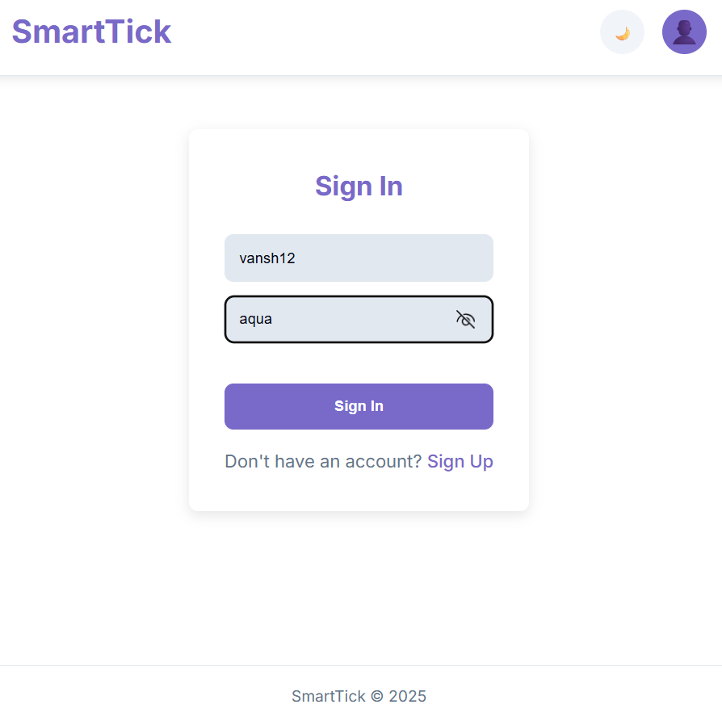
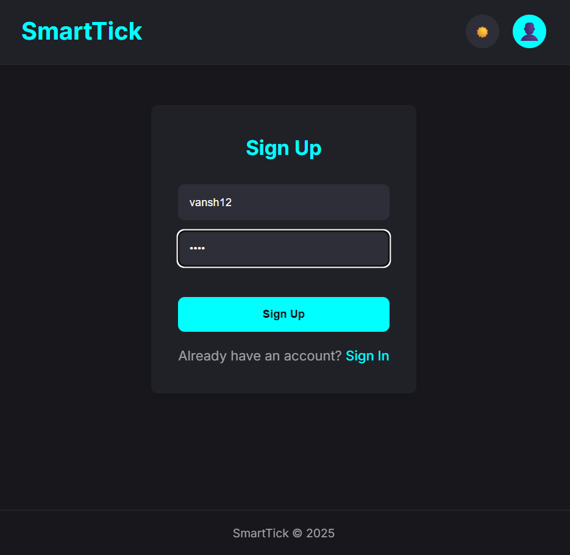
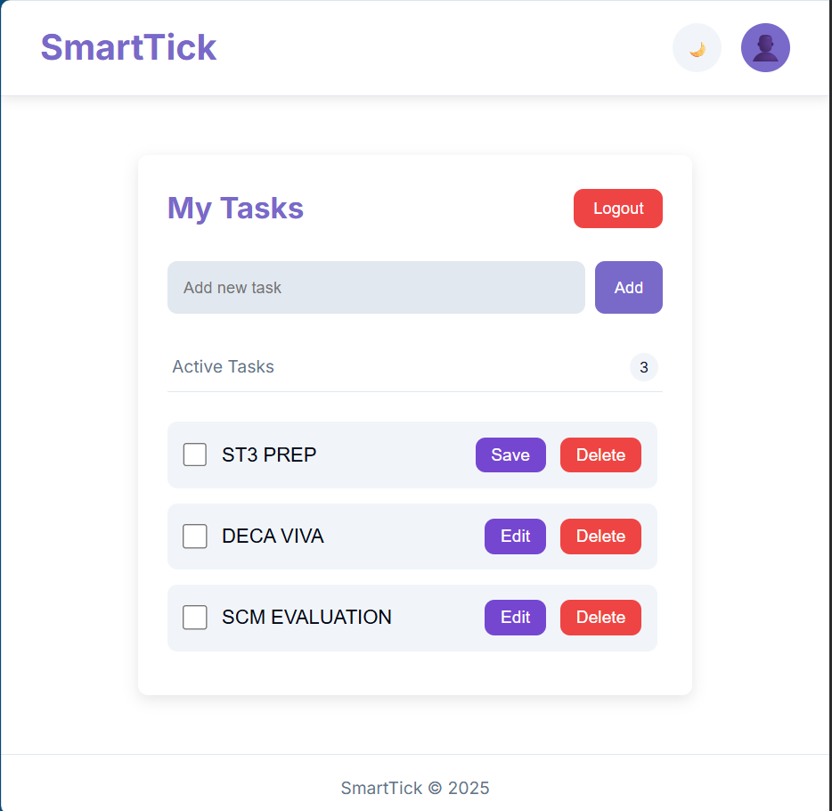
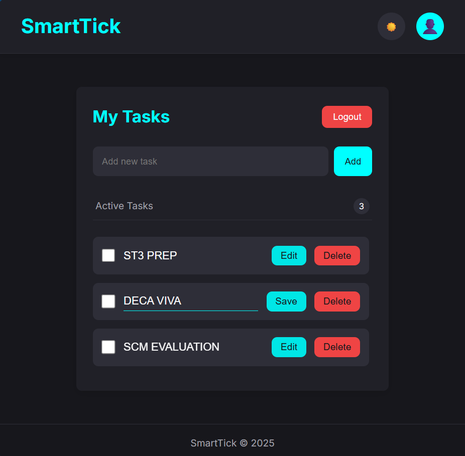
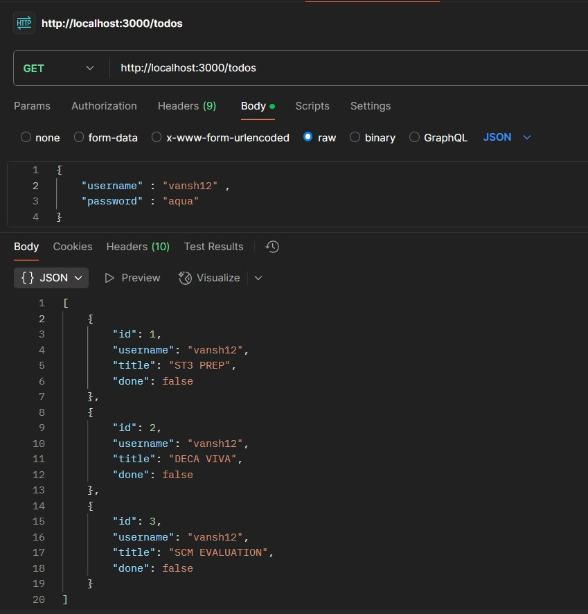

# ✅ SmartTick - To-Do List Web App

**SmartTick** is a full-stack to-do list application where users can stay productive by managing their tasks easily and securely. With user accounts, persistent data storage, and a clean interface supporting both light and dark modes, SmartTick is the smart way to track your tasks!

---

## 🌟 Features

- 🔐 User Registration and Login
- ➕ Add new tasks
- ✏️ Edit tasks
- ✅ Mark tasks as completed
- 🗑️ Delete tasks
- 💡 Light and 🌙 Dark mode UI
- 📦 Persistent backend storage for user data and task lists

---

## 🧰 Tech Stack

- **Frontend**: HTML, CSS, JavaScript
- **Backend**: [Node.js]

---

## 🖼️ Screenshots

### 🔐 Login Page


### 🆕 Sign-Up Page


### 📋 Dashboard - Light Mode


### 🌙 Dashboard - Dark Mode


### 🧠 Backend Stored Data


---

## ⚙️ Getting Started

1. **Clone the Repository**
   ```bash
   git clone https://github.com/MasterXCoder/To_Do_List.git
   cd To_Do_List
